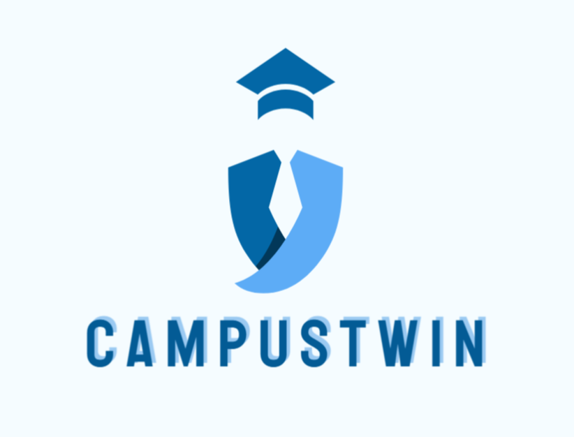
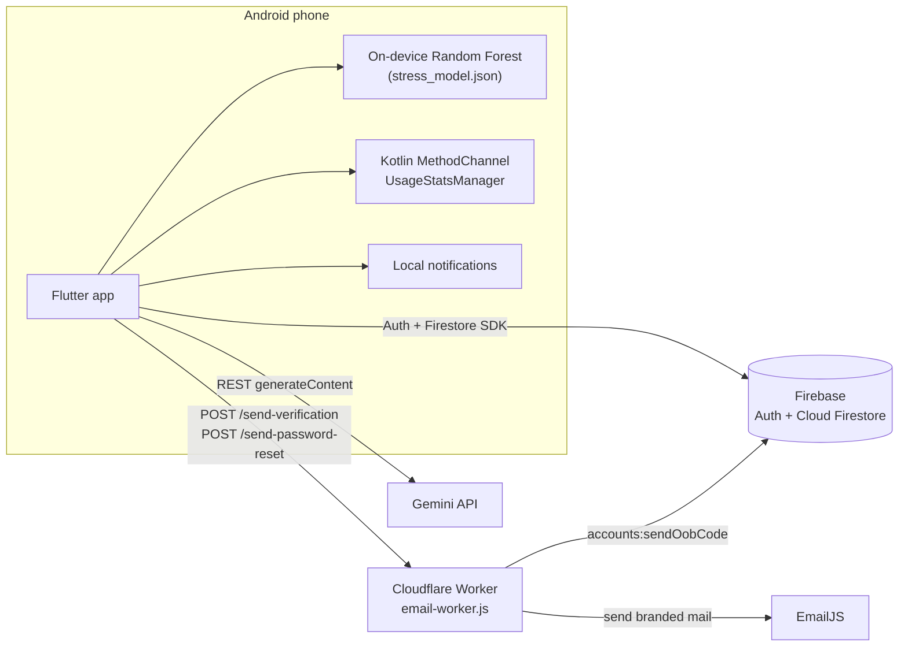

<div align="center">



# CampusTwin

**AI-Powered Digital Twin for University Students**

Study planner · Habit & stress tracker · Money manager · Gemini assistant · Leaderboard — in one Android app.


</div>

---

## Table of Contents

1. [Overview](#1-overview)
2. [Features](#2-features)
3. [How the Core Logic Works](#3-how-the-core-logic-works)
4. [Architecture](#4-architecture)
5. [Tech Stack](#5-tech-stack)
6. [Data Model](#6-data-model)
7. [Activity Diagrams](#7-activity-diagrams)
8. [Project Structure](#8-project-structure)
9. [Getting Started](#9-getting-started)
10. [Retraining the Stress Model](#10-retraining-the-stress-model)
11. [Testing](#11-testing)
12. [Android Permissions](#12-android-permissions)
13. [Known Limitations](#13-known-limitations)
14. [Roadmap](#14-roadmap)
15. [Team](#15-team)
16. [Acknowledgements](#16-acknowledgements)

---

## 1. Overview

University students juggle lectures, assignments, sleep, phone use and pocket money with several unrelated apps, none of which sees the whole picture. **CampusTwin** keeps a *digital twin* of the student: a continuously updated record of what they study, how they live and how they spend. The app reflects that record back as schedules, scores, charts and AI-generated advice.

- **Target users:** university students, especially undergraduate engineering students who follow a level/term curriculum.
- **Roles:** one human role, the *Student*. There is no teacher or admin interface.
- **Platform:** Android (the screen-time and app-picker features depend on Android APIs).
- **Languages / themes:** English and Bangla, light and dark.

This project was built for the **SDP2** course, Department of CSE, Military Institute of Science and Technology (MIST), Group B8.

---

## 2. Features

| Module | What it does |
|---|---|
| **Authentication & profile** | E-mail/password and Google sign-in. A verified e-mail is required before entering the app (every blocked attempt re-sends the link). Password reset by e-mail. Editable profile (name, e-mail, phone, student ID, department, semester, photo from camera or gallery). Level and term are derived from the semester. |
| **Course set-up** | On first sign-in the student lists the courses of the current term (title + code) or skips. Old courses are replaced in one Firestore batch. Level/term and, for Level 4, elective choices are made later in the planner's level/term sheet. |
| **Twin Dashboard** | Greeting, today's schedule (live Firestore stream), upcoming deadlines, weekly study-hours chart, subject-distribution chart, daily check-in streak, remaining monthly budget, leaderboard rank and a side drawer to the other screens. |
| **Smart Study Planner** | Week view with a progress bar. Task types: class, study, revision, assignment, exam preparation. Rejects overlapping tasks, tasks that end before they start, and past dates. *Generate plan* adds conflict-free study/revision blocks. Complete, undo (with a reason) or delete tasks. Escalating local reminders. |
| **Habit Tracker** | Sleep, water, exercise and screen time with daily goals, progress rings, weekly bar charts and per-habit streaks. A weighted 0–100 habit score summarises the day. Screen time is measured from Android usage statistics. |
| **Stress prediction** | An on-device Random Forest predicts a stress class from sleep, exercise and screen time. Its output is blended with the habit score, and Gemini writes five short wellness insights from the result. |
| **Twinny (AI assistant)** | A Gemini chat assistant. Every request carries a snapshot of the student's own data (profile, courses, budget and recent transactions, study plans, seven days of habits, latest stress), so answers quote real numbers. Chat history is stored in Firestore. |
| **Money manager** | Income/expense tracker with built-in categories, calendar view and charts. |
| **Daily check-in** | A consecutive-day streak that awards reward points (`day number × 10`). |
| **Leaderboard** | Peer ranking from planner and habit activity. No financial data is used. |
| **Focus session** | Usage-access permission, installed-app picker and session set-up screen (see [limitations](#13-known-limitations)). |
| **Notifications** | Scheduled local reminders that fire offline, plus an in-app notification centre. |
| **Bilingual UI** | English/Bangla strings with a runtime language switch, and light/dark themes. |

---

## 3. How the Core Logic Works

### 3.1 Goal-aware habit score

Each habit is compared with the student's own goal (defaults are used until a goal is saved: 7.5 h sleep, 2.5 L water, 30 min exercise, at most 3 h screen time). The day's score is a weighted sum:

| Habit | Weight |
|---|---|
| Sleep | 30 |
| Water | 25 |
| Exercise | 25 |
| Screen time | 20 |

### 3.2 On-device Random Forest

```text
Kaggle stress dataset (3 000 rows)
   └─ scikit-learn: RobustScaler → SMOTE (train split only) → RandomForest
        (50 trees, max depth 6, min leaf 8)
   └─ export each tree as arrays → assets/stress_model.json (≈ 0.19 MB)
   └─ Dart tree interpreter (lib/services/stress_model.dart) runs it on the phone
```

- **Inputs:** sleep hours, exercise minutes ÷ 30, screen-time hours.
- **Output:** class (low / moderate / high) and class probabilities.
- No server, no ML runtime: the trained forest is just JSON walked by a ~140-line Dart interpreter.

### 3.3 Blended stress score

`lib/services/stress_predictor.dart` combines two signals 50/50:

```text
model score  = 20·P(low) + 55·P(moderate) + 90·P(high)
rule score   = 100 − habit score
stress score = 0.5 · model score + 0.5 · rule score
level        = low (< 40) · moderate (≤ 70) · high (> 70)
```

The model is weak on its own (see [limitations](#13-known-limitations)), which is why it is blended with the transparent rule-based score.

### 3.4 AI insights and refresh rule

Gemini (`gemini-3.5-flash-lite`, JSON mode, temperature 0.4, 1024 tokens, 30 s timeout) returns five insights. Insights are cached in Firestore with a fingerprint of the habit metrics and **regenerated only on a new day or when the metrics change**. Built-in insights are shown whenever the call fails. The chat assistant uses temperature 0.7, 512 tokens and a 60 s timeout.

### 3.5 Conflict-free planning

Every task, whether typed by the student or suggested by *Generate plan*, goes through the same validation: no overlap with an existing task, end after start, and no past dates. Suggestions are placed only in free slots.

### 3.6 Leaderboard score

Computed on the device from non-monetary data only:

```text
planner score = 40 % streak + 35 % completed tasks + 25 % study minutes   (last 30 days)
habit score   = 85 % average habit score + 15 % check-in streak bonus
overall       = 55 % planner + 45 % habits
```

### 3.7 Escalating deadline reminders

For an **assignment**, reminders fire 6 h, 3 h, 2 h, 1 h and 30 min before the deadline and at the deadline (the last three are high-priority alerts). Other task types are reminded 1 h and 5 min before they start. Each task owns a block of 30 notification ids so that all its reminders can be cancelled on edit/delete. A reminder that became due less than five minutes ago is shown immediately; inexact alarms are used when the Android 12+ exact-alarm permission is missing.

### 3.8 Real screen time

A Kotlin `MethodChannel` reads Android `UsageEvents` (foreground/background per package; `MOVE_TO_FOREGROUND/BACKGROUND` or the older `RESUMED/PAUSED`) and sums the foreground intervals. A background event without a matching foreground event is skipped instead of guessed, which removed a false half-hour baseline each morning. The weekly chart (Mon–Sun) is filled by calling the same function per day, and today's value refreshes every 45 s. If usage access is missing, a notice with a shortcut to the system settings is shown.

### 3.9 Grounded assistant

Twinny's system prompt is rebuilt for each request from Firestore (`_userContext()`), so the model answers from the student's real profile, courses, budget, plans, habits and latest stress result instead of guessing.

### 3.10 Custom validation and ownership rules

- E-mail check accepts the MIST student pattern (7–10 digits + `@student.mist.ac.bd`), Gmail, and any other well-formed address; sign-in is blocked until the address is verified.
- Study sessions belong to a plan, so the Firestore rules `get()` the parent plan and allow writes only to its owner.

---

## 4. Architecture



**Design choices in one line each**

- **Firebase Auth + Firestore:** real-time streams, offline cache, per-user security rules and no server to maintain.
- **Cloudflare Worker for e-mail:** creates verification/reset links through the Identity Toolkit API and sends them as branded mail through EmailJS, so no paid backend is needed.
- **On-device ML:** private, works offline and needs no prediction server.
- **Local notifications:** the reminder times are known on the device, so local scheduling is more reliable than push.

---

## 5. Tech Stack

| Layer | Technology |
|---|---|
| App | Flutter, Dart (SDK `^3.12.2`), Material widgets |
| Auth | `firebase_auth`, `google_sign_in` |
| Database | `cloud_firestore` (11 composite indexes in `firestore.indexes.json`) |
| AI | Gemini REST API (`gemini-3.5-flash-lite`) via `http` |
| ML | scikit-learn, imbalanced-learn, pandas (offline); Dart tree interpreter (on device) |
| E-mail | Cloudflare Worker (`email-worker.js`), EmailJS, Firebase Identity Toolkit |
| Notifications | `flutter_local_notifications`, `timezone`, `flutter_timezone` |
| Device | Kotlin `MethodChannel` + `UsageStatsManager`, `device_apps` (local fork in `packages/device_apps`), `image_picker` |
| UI extras | `flutter_markdown` (assistant replies), `flutter_localizations` (English/Bangla) |
| Config | `flutter_dotenv` (`.env` asset) |
| Tooling | Firebase CLI, `firebase-admin` seed scripts (Node.js) |

> Declared but not used by the client code: `cloud_functions`, `firebase_messaging`, `permission_handler`, `cupertino_icons`. The Cloud Functions in `functions/` are not called by the app.

---

## 6. Data Model

<p align="center">
  
</p>

Firestore collections (snake_case). The document id of `users/{uid}` is the Firebase Auth uid; no password is stored in Firestore.

| Collection | Status | Purpose |
|---|---|---|
| `users` | Active | Profile: name, e-mail, phone, student ID, department, semester, level/term, electives, photo, set-up flag |
| `courses` | Active | The student's courses (written by course set-up) |
| `course_catalog` | Active | Seeded level/term curriculum used to offer electives |
| `study_plans` | Active | One plan per student, created on demand |
| `study_sessions` | Active | Each planner task; also stores a copy of `user_id` for leaderboard queries |
| `habit_logs` | Active | One log per day: four habit values + habit score |
| `habit_goals` | Active | Daily goals per habit (document id = uid) |
| `stress_predictions` | Active | Blended score, level, AI insights, model output and metrics snapshot |
| `ai_chats` | Active | One document per question/answer |
| `daily_checkins` | Active | Streak day number and reward points |
| `expenses` | Active | Income and expense entries |
| `notifications`, `budgets`, `expense_categories`, `assignments`, `achievements`, `user_achievements` | Schema / rules only | Not written by any screen yet |

> **Note:** `firestore.rules` currently has no rule block for `habit_goals`. Add one (owner-only, like the other per-user collections) before deploying, otherwise goal saving is denied by Firestore's default-deny.

---

## 7. Activity Diagrams

Swim-lane diagrams for each feature (Student, CampusTwin App, Firebase Backend and, where used, Gemini). Click a title to expand.

<details><summary><b>UC-01 Register a new account</b></summary>

</details>

<details><summary><b>UC-02 Sign in</b></summary>

</details>

<details><summary><b>UC-03 Reset a forgotten password</b></summary>

</details>

<details><summary><b>UC-04 Set up the courses</b></summary>

</details>

<details><summary><b>UC-05 Open the Twin Dashboard</b></summary>

</details>

<details><summary><b>UC-06 Add or edit a study task</b></summary>

</details>

<details><summary><b>UC-07 Generate a smart study plan</b></summary>

</details>

<details><summary><b>UC-08 Complete, undo or delete a study task</b></summary>

</details>

<details><summary><b>UC-09 Set a habit goal and log a habit</b></summary>

</details>

<details><summary><b>UC-10 Complete the daily check-in</b></summary>

</details>

<details><summary><b>UC-11 Predict the stress level and generate insights</b></summary>

</details>

<details><summary><b>UC-12 Record an income or an expense</b></summary>

</details>

<details><summary><b>UC-13 Chat with the AI assistant</b></summary>

</details>

<details><summary><b>UC-14 Configure a focus session</b></summary>

</details>

<details><summary><b>UC-15 View the leaderboard</b></summary>

</details>

---

## 8. Project Structure

```text
campus_twin/
├── lib/
│   ├── main.dart                     # app entry, dotenv + Firebase init, locales
│   ├── app_widget.dart, theme.dart, l10n.dart, app_settings.dart
│   ├── welcome_page.dart, login.dart, register.dart
│   ├── course_setup_page.dart        # course set-up onboarding
│   ├── twinDashboard.dart            # dashboard + drawer
│   ├── planner_page.dart             # weekly planner, validation, level/term sheet
│   ├── planner_notifications.dart    # escalating local reminders
│   ├── habitTracker.dart             # habits, goals, check-in, screen time, stress UI
│   ├── budget_page.dart              # income/expense manager
│   ├── assistant.dart                # Twinny chat
│   ├── leaderboard_page.dart, leaderboard_scoring.dart
│   ├── app_blocker_page.dart         # focus session screen
│   ├── notifications_page.dart, profile_edit_sheet.dart, seed_courses.dart
│   ├── models/app_models.dart        # one class per entity (fromMap/toMap)
│   ├── repositories/                 # generic FirestoreRepository<T> + per-collection repos
│   └── services/
│       ├── gemini_service.dart       # chat + insights
│       ├── stress_model.dart         # Random Forest tree interpreter
│       ├── stress_predictor.dart     # blended stress score
│       ├── verification_email_service.dart
│       └── password_reset_email_service.dart
├── android/                          # Kotlin MethodChannel for usage stats
├── assets/                           # Campus_Twin.png, stress_model.json
├── ml/train_stress_model.py          # offline training + JSON export
├── ml_dataset/                       # stress dataset (CSV)
├── packages/device_apps/             # local fork of the device_apps plugin
├── scripts/                          # seed_firestore.js, list_firestore.js
├── functions/                        # Firebase Cloud Functions (not used by the client)
├── email-worker.js                   # Cloudflare Worker for verification/reset e-mails
├── firestore.rules, firestore.indexes.json, firebase.json
├── test/                             # unit and widget tests
└── docs/images/                      # ER and activity diagrams used in this README
```

---

## 9. Getting Started

### 9.1 Prerequisites

- Flutter SDK with Dart **≥ 3.12.2** and the Android toolchain (`flutter doctor`)
- An Android device or emulator (API 23+ is required by Firebase Auth)
- A [Firebase](https://console.firebase.google.com/) project
- A [Gemini API key](https://aistudio.google.com/apikey)
- Node.js and the Firebase CLI (`npm i -g firebase-tools`) for rules, indexes and seeding
- *(Optional, for e-mail branding)* a Cloudflare account and an [EmailJS](https://www.emailjs.com/) account
- *(Optional, to retrain the model)* Python 3.10+

### 9.2 Clone

```bash
git clone https://github.com/alif-ul-haque/CampusTwin.git
cd CampusTwin
flutter pub get
```

### 9.3 Firebase project

1. In the Firebase console, create a project and add an **Android app** with the package name `com.campustwin.app`. Download `google-services.json` into `android/app/` (the repository contains the original developers' file, so replace it with the one from your own project).
2. **Authentication → Sign-in method:** enable **Email/Password** and **Google**. For Google sign-in add your debug/release **SHA-1 and SHA-256** fingerprints to the Android app (`cd android && ./gradlew signingReport`).
3. **Firestore Database:** create a database.
4. Deploy the rules and indexes:

   ```bash
   firebase login
   firebase use <your-project-id>
   firebase deploy --only firestore:rules,firestore:indexes
   ```

   (Remember the `habit_goals` note in [Data Model](#6-data-model).)

### 9.4 Environment file

The app reads its configuration from a `.env` file in the project root. The file is **git-ignored** but declared as a Flutter asset, so it must exist before you build.

```dotenv
# Firebase (from your Firebase project settings)
FIREBASE_PROJECT_ID=your-project-id
FIREBASE_ANDROID_API_KEY=...
FIREBASE_ANDROID_APP_ID=1:1234567890:android:abcdef
FIREBASE_MESSAGING_SENDER_ID=1234567890
FIREBASE_STORAGE_BUCKET=your-project-id.appspot.com

# Only needed if you build for iOS
FIREBASE_IOS_API_KEY=
FIREBASE_IOS_APP_ID=
FIREBASE_IOS_BUNDLE_ID=

# Gemini
GEMINI_API_KEY=your-gemini-key

# Base URL of the deployed e-mail worker (optional, see 9.5)
RESET_EMAIL_WORKER_URL=https://your-worker.your-subdomain.workers.dev
```

The Gemini key can also be passed at build time and takes priority over `.env`:

```bash
flutter run --dart-define=GEMINI_API_KEY=your-gemini-key
```

> ⚠️ Anything in `.env` is bundled into the APK as an asset, so it can be extracted from a distributed build. Do not put secrets you cannot rotate in it (see [Known Limitations](#13-known-limitations)).

### 9.5 E-mail worker (optional)

`email-worker.js` sends the branded verification and password-reset e-mails. Deploy it as a **Cloudflare Worker** (ES-module syntax) and set these secrets:

| Secret | Meaning |
|---|---|
| `FIREBASE_PROJECT_ID` | your Firebase project id |
| `FIREBASE_CLIENT_EMAIL` | service-account e-mail |
| `FIREBASE_PRIVATE_KEY` | service-account private key |
| `EMAILJS_SERVICE_ID` | EmailJS service |
| `EMAILJS_TEMPLATE_ID` | EmailJS template (variables: e-mail, action link, intro text, button text) |
| `EMAILJS_PUBLIC_KEY` | EmailJS public key |
| `EMAILJS_PRIVATE_KEY` | EmailJS private key |

Endpoints (both `POST`, JSON body): `/send-password-reset` (`{ "email": ... }`) and `/send-verification` (`{ "email": ..., "idToken": ... }`). Put the worker's base URL in `RESET_EMAIL_WORKER_URL`. If it is empty or a call fails, the app falls back to Firebase's built-in e-mails.

### 9.6 Seed the course catalogue

The level/term elective picker reads the `course_catalog` collection.

1. Firebase console → Project settings → **Service accounts** → *Generate new private key*, save it as `service-account.json` in the project root (**never commit it**; it is git-ignored).
2. Run:

   ```bash
   npm install firebase-admin
   node scripts/seed_firestore.js
   ```

   The script seeds sample documents and the global CSE syllabus, and skips `course_catalog` if it is already populated. `node scripts/list_firestore.js` lists collections, document counts and field names for checking.

### 9.7 Run and build

```bash
flutter run                     # debug on a connected device/emulator
flutter build apk --release     # release APK in build/app/outputs/flutter-apk/
```

On first launch, grant **Usage access** (Settings → Apps → Special access → Usage access → CampusTwin) so that real screen time and the focus screen work, and allow notifications (and exact alarms on Android 12+).

---

## 10. Retraining the Stress Model

```bash
pip install pandas numpy scikit-learn imbalanced-learn joblib
python ml/train_stress_model.py
```

The script reads `ml_dataset/extended_stress_detection_data.csv`, trains the pipeline, prints accuracy, balanced accuracy, macro F1 and the confusion matrix, then writes:

- `ml/stress_rf.pkl` — the scikit-learn model (for inspection)
- `assets/stress_model.json` — the compact tree export loaded by the app

Feature order is fixed: `[sleep_hours, exercise_minutes / 30, screen_time_hours]`; classes are `0 = low, 1 = moderate, 2 = high`. If you change the features, update `lib/services/stress_predictor.dart` as well, and re-run the model tests.

---

## 11. Testing

```bash
flutter analyze
flutter test
```

The `test/` folder covers the data models, habit goals, the planner and the stress model. There are no tests yet for the assistant, the screen-time channel or model accuracy regression.

---

## 12. Android Permissions

| Permission | Why |
|---|---|
| `INTERNET` | Firebase, Gemini, e-mail worker |
| `PACKAGE_USAGE_STATS` | Real screen time (granted by the user in system settings) |
| `QUERY_ALL_PACKAGES` | List installed apps for the focus-session picker |
| `POST_NOTIFICATIONS` | Local reminders (Android 13+) |
| `SCHEDULE_EXACT_ALARM`, `USE_EXACT_ALARM` | Exact-time reminders |
| `RECEIVE_BOOT_COMPLETED` | Lets the notifications plugin re-schedule reminders after a reboot |
| `VIBRATE` | Notification vibration |
| `REQUEST_INSTALL_PACKAGES` | Declared in the manifest; no current feature uses it |

---

## 13. Known Limitations

- **Stress model is weak.** It uses only three features and reaches about **49 % accuracy** on our held-out split (majority-class baseline 42 %). It was trained on a public dataset, not on CampusTwin students, and has no clinical validation, which is why it is blended 50/50 with the rule-based score. Treat the result as a wellness hint, not a diagnosis.
- **Dashboard stress chip is a placeholder.** It only cycles low → medium → high when tapped and is not connected to the stored predictions. Attendance is not tracked. The streak and budget tiles start with built-in values (5 days, 2400) until the Firestore reads finish.
- **Focus session does not block apps yet.** Selection, duration and state exist, but there is no blocking and no countdown timer. Android only.
- **Assistant.** The data snapshot excludes planner tasks (`study_sessions`); `budgets` and `assignments` blocks are usually empty; only the last 8 transactions are sent; only the current session's messages go to the model; the assistant cannot create tasks.
- **Planner suggestions** are two template blocks per slot and ignore deadlines, difficulty and free time.
- **Budget:** no monthly/category limits or alerts, although the schema has them.
- **Gamification:** only check-in points and the leaderboard; no badges.
- **Notifications** are local only; Firebase Cloud Messaging is not used.
- **Security and scale**
  - The Gemini key and Firebase config are bundled with the app through `.env`.
  - The leaderboard is computed on the device from up to 200 users, which is why the rules let any signed-in user read whole `users` documents (including e-mail, phone, student ID) and the `study_sessions`, `habit_logs`, `daily_checkins` and `assignments` collections. Financial collections stay owner-only.
  - `course_catalog` and `expense_categories` allow signed-in writes.
  - There is no `habit_goals` rule block yet (see [Data Model](#6-data-model)).
  - Account deletion removes only the Firebase Auth user, not the Firestore data.
- **Tests:** none for the assistant, the screen-time channel or model accuracy.

---

## 14. Roadmap

1. Connect the dashboard stress chip to stored predictions and show real attendance.
2. Add a real app blocker with a countdown timer.
3. Smarter planner: suggestions that consider deadlines, difficulty and free time.
4. Let Twinny take actions (create tasks, log habits) and include planner tasks in its context.
5. Budgets with monthly and category limits and alerts.
6. Achievements and badges using the existing schema.
7. Firebase Cloud Messaging with server-side push and weekly summary reports.
8. Security hardening: move the Gemini key behind a Cloud Function, compute the leaderboard on the server, restrict shared-collection writes, delete Firestore data on account deletion, optionally restrict registration to the institutional e-mail domain.
9. A better stress model with more inputs (workload, exam proximity, sleep trends) and CampusTwin-specific data.
10. iOS support for usage statistics, offline-first sync, more automated tests and CI.

---

## 15. Team

**Group B8 — Department of CSE, Military Institute of Science and Technology (MIST)**

- M.M. Tamim Sharif
- Alif Ul Haque
- Tasnim Hasan Taz
- Abu Salah Md. Jamil

---

## 16. Acknowledgements

- Stress-level dataset: the Kaggle *Human Stress Detection – Extended* dataset (`ml_dataset/`).
- [`device_apps`](https://pub.dev/packages/device_apps) plugin, vendored with local adjustments in `packages/device_apps/`.
- Firebase, Google Gemini, Cloudflare Workers and EmailJS.
